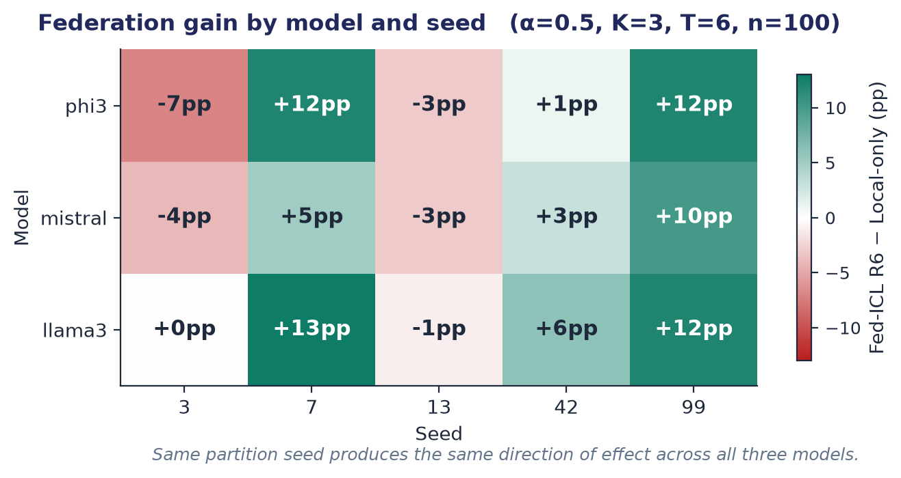

# Fed-ICL Lab Notebook

A running log of decisions, results, and reasoning for the dissertation
"Collaborative In-Context Learning in Federated Settings".

Newest entries at the bottom.

---

## Project framing (early April 2026)

**Research question** (agreed with Dr. Jin):
*How does the ordering of in-context examples affect convergence and final
accuracy in federated in-context learning, and does this effect interact
with data heterogeneity?*

Direction chosen: optimisation, not vulnerability. Centred on example
selection strategies; what to select, ordering, batch size.

Five papers read as foundation: Fed-ICL (Wang et al., ICML 2025),
FedAvg (McMahan et al., 2017), KATE / What Makes Good ICL Examples
(Liu et al., 2022), Language Models are Few-Shot Learners
(Brown et al., 2020), Rethinking the Role of Demonstrations
(Min et al., 2022).

Negative results agreed to be valid; rigour of analysis prioritised.

---

## Initial implementation (early April)

Built a 7-file Python codebase replicating Algorithm 1 from Wang et al.:
`config.py`, `data.py`, `llm.py`, `federation.py`, `main.py`,
`requirements.txt`, `README.md`.

Core components:
- Dirichlet partitioning across K=3 simulated clients
- Iterative rounds of client relabelling and server-side majority-vote
  aggregation
- Five ordering strategies in `federation.py` controlled via
  `ORDER_STRATEGY` in `config.py`: `original`, `similarity_ascending`,
  `similarity_descending`, `label_grouped`, `label_alternating`,
  `random_shuffle`

Run locally on M4 MacBook Air via Ollama (llama3, mistral, phi available).

Two early bugs: `LABEL_SPACE` ImportError (resolved by importing from
`data.py` rather than `config.py`); `ZeroDivisionError` when extreme
Dirichlet alpha values left a client with zero examples.

---

## First result: binary sentiment task, saturation (early April)

Ran the implementation on a binary sentiment classification task
(positive/negative).

**Result:** llama3 zero-shot accuracy was 95–100% from the start.
Federation could not improve on this, no headroom.

**Interpretation:** Task was too easy for llama3. Federation cannot
demonstrate value when the baseline is already at ceiling.

**Action taken:** Switched task to 4-class news topic classification
(world / sports / business / science) using a hand-written 152-example
synthetic dataset (38 per class).

**Why:** A 4-class task is harder than binary. The hypothesis was that
the increased class count would create the headroom federation needs to
demonstrate gain.

---

## Second result: synthetic 4-class, also saturated (early April)

Ran with the synthetic 152-example news dataset.

**Result:** Round 0 (random init): 16.7%. Round 1 onwards: 100%.
Held-out test set: 95%. Zero-shot baseline: 100%. Local-only: 100%.

**Interpretation:** llama3 also saturates the synthetic 4-class task.
Two factors compound: (1) llama3 is a strong instruction-tuned model
that handles news classification trivially, (2) the synthetic data was
hand-written with clear category signals, making it cleaner and easier
than realistic news.

This is preserved as `results_synthetic_saturation_evidence.json` in the
repo as evidence for the methodological observation that capable LLMs
saturate common ICL benchmarks.

**Action taken:** Prepared progress slides for Dr. Jin documenting the
saturation finding, then had to step away from the project for ~3 weeks
due to emergency travel.

---

## Resumption (28 April 2026)

Returned to the project after a 3-week gap. Reviewed Dr. Jin's 10 April
email, which gave guidance on five points:

1. Switch to a HuggingFace benchmark dataset
2. GPU access via mcrugcomp03.ex.ac.uk (SSH) or University GPU VMs
3. Fix random seed as constant for now; vary later for robustness
4. Focus next: switch dataset, establish solid baseline
5. Set up GitHub repo and share link

---

## GitHub setup (28 April)

Created private repository, then made public for ease of access on the
GPU server. Initial commit: codebase, README, .gitignore, and the
synthetic saturation evidence JSON.

`.gitignore` configured to exclude `venv/`, `__pycache__/`, `.DS_Store`,
`.continue/`, and `results*.json` , but with an explicit exception for
`results_synthetic_saturation_evidence.json`, which is preserved as
evidence of the saturation finding.

Required cleanup: initial `git add .` had captured `__pycache__/`,
`.DS_Store`, and `.continue/` files because the staging happened before
`.gitignore` was finalised. Resolved with `git rm -r --cached . && git add .`
to re-apply ignore rules.

Repo URL: `https://github.com/pr0naive/fed_icl_project`

---

## AG News dataset switch (28 April)

Replaced the synthetic 152-example dataset in `data.py` with HuggingFace
AG News (loaded via the `datasets` library). Changes:

- Added `_AG_NEWS_LABEL_MAP` to convert AG News integer labels (0-3) to
  the existing string label space (world/sports/business/science).
  AG News class 3 is officially "Sci/Tech" but mapped to "science" to
  preserve the existing prompt template.
- Added `_load_ag_news(num_examples, seed)` to load and deterministically
  subsample.
- Replaced the `RAW_DATA = [...]` literal with
  `RAW_DATA = _load_ag_news(num_examples=200, seed=SEED)`.

Everything else (`LABEL_SPACE`, `partition_data_dirichlet`,
`prepare_experiment`) unchanged.

**Why this dataset:**
- Standard benchmark in the ICL literature, comparable to other work
- Same 4-class structure as the synthetic data, minimal disruption
- Real news headlines are noisier and more ambiguous than hand-written
  examples, expected to provide headroom

---

## Environment fix: Python 3.14 → 3.12 (28 April)

Initial venv was created with Python 3.14 (newest stable). pip itself
was broken inside the venv: `ModuleNotFoundError: No module named
'pip._vendor.rich.markup'`. Cause: bundled pip in 3.14 venv missing
internal modules.

**Action taken:** Rebuilt venv with Python 3.12 (more mature for ML
tooling). Resolved.

**Why:** Python 3.14 is too new, many ML packages, including the
bundled pip, haven't fully caught up. 3.10–3.12 is the stable range.

---

## First AG News result (28 April, evening)

First run on AG News, default config:
- N=200 total examples, EVAL_SIZE=40, NUM_SERVER_QUERIES=30
- 3 clients, 6 rounds, alpha=0.5, 3 shots, llama3
- Runtime: 48 minutes

**Results:**
| Metric | Value |
|---|---|
| Zero-shot baseline | 95.0% (19/20) |
| Local-only baseline | 80.0% (16/20) |
| Round 0 (random init) | 33.3% |
| Rounds 1-4 | 76.7% |
| Rounds 5-6 | 80.0% |
| Held-out test set | 75.0% (15/20) |

**Federation gain over random init: +46.7%.**
**Federation accuracy *below* zero-shot baseline: -15.0%.**

**Interpretation:**
This is more interesting than expected. AG News is partially saturated
(zero-shot at 95%) but a clear federation curve is visible, random
init at 33% climbs monotonically to 80%. However, federation converges
*below* zero-shot, not above it.

The mechanism appears to be: llama3 already classifies news headlines
well without examples. Adding examples drawn from a Dirichlet-skewed
client pool (Client 0 has 25 world / 10 sports / 12 business / 22 science
out of 69 total) introduces a class-distribution bias. Three randomly
selected examples might be three "world" headlines, which causes the
model to over-weight that class for the next prediction. Adding biased
examples is worse than no examples for a model that's already strong on
the task.

This is consistent with Min et al. (2022): when base models are
strong, examples function more as distribution priors than as
demonstrations.

**Why this matters for the dissertation:**
This isn't a saturation failure, it's potentially a finding in its own
right. "Federated ICL fails to exceed zero-shot performance for capable
LLMs on standard benchmarks" is a defensible result with a clear
mechanism. The interaction with heterogeneity (alpha) becomes the
research question: at what level of heterogeneity does federation start
to add or subtract value over zero-shot?

**Eval set sizes are small.** 30 server queries and 20 test examples
means single-example flips move accuracy by 3–5 percentage points.
Ordering effects are typically smaller than this. Need to scale up.

---

## Action: scaling up evaluation (28 April, night)

Changes:
- `config.py`: `NUM_SERVER_QUERIES` 30 → 100, `EVAL_SIZE` 40 → 100
- `data.py`: `_load_ag_news(num_examples=...)` 200 → 350

Expected runtime: ~2–2.5 hours per run on the Mac (3× the previous run).

**Why:** to reduce per-example noise floor below the size of effects
we expect to measure (ordering differences typically 2–10 pp).

[Run in progress]

---

## GPU server access, pending (28 April)

Attempted SSH to `mcrugcomp03.ex.ac.uk` after VPN setup. Authentication
fails immediately after password entry: `Connection closed by port 22`.
Likely cause: account exists but isn't provisioned for shell access on
this specific server.

Emailed Dr. Jin to verify provisioning. Awaiting response.

**Workaround:** Local Mac runs are workable for the experiment sweep
(~2 hours per run × 12 runs = ~24 hours total, doable in two overnight
batches). GPU server becomes more useful when testing smaller models
(mistral, phi) to deliberately introduce headroom.

---

## Open questions / next steps

- Does the zero-shot vs Fed-ICL gap hold at n=100 evaluation?
- Does federation gain (over random init, not over zero-shot) vary with
  alpha?
- Do the five ordering strategies produce measurable differences at
  this eval size?
- If saturation persists with llama3, does federation behave differently
  with a weaker model (mistral 7B, phi 3.8B)?


## First scaled run, 100 server queries, baselines still on 20 (29 April, ~12:30 AM)

Ran with `NUM_SERVER_QUERIES=100`, `EVAL_SIZE=100`, total examples=350.

**Runtime: 6,642 seconds = 110 minutes** (≈2× the previous run, slightly
under prediction). Fed-ICL evaluation now over 100 server queries.

**Results:**
| Metric | Value | n |
|---|---|---|
| Zero-shot baseline | 75.0% | 20 |
| Local-only baseline | 80.0% | 20 |
| Round 0 (random init) | 25.0% | 100 |
| Round 1 | 76.0% | 100 |
| Round 2 | 79.0% | 100 |
| Round 3 | 79.0% | 100 |
| Round 4 | 80.0% | 100 |
| Round 5 | 76.0% | 100 |
| Round 6 | 78.0% | 100 |
| Held-out test | 75.0% | 20 |

Federation gain over random init: +53.0 pp (25% → 78%).

**Critical observation:** baselines and test set are still on 20
examples, `main.py` has hardcoded `eval_set[:20]` slices. Only the
Fed-ICL round-by-round evaluation actually scaled to 100. So
zero-shot/local-only/test numbers remain noisy.

Zero-shot dropped from 95% to 75% between runs despite both being on 20
examples, suggests the original 95% was an outlier from favourable
sampling. Fed-ICL convergence (78%) is much more reliable being based
on 100 examples.

The Dirichlet partition was sharply skewed this time: Client 0 had 0
sports, Client 1 had 30 sports out of 66, Client 2 had only 13 total
examples. Federation still converged consistently, encouraging
indication that majority voting handles severe heterogeneity at α=0.5.

**Action:** Removed the hardcoded `[:20]` in `main.py` so baselines run
on the full eval set. Re-run baseline before drawing any conclusion
about whether Fed-ICL exceeds, equals, or underperforms zero-shot.

**Why:** Cannot compare 100-example Fed-ICL to 20-example baseline.
Single example flips on n=20 move accuracy by 5 pp, larger than any
real effect we'd expect to detect. Baselines must be at the same scale.

## Corrected baseline, all metrics on n=100 (29 April, ~6:30 AM)

After fixing the hardcoded `eval_set[:20]` slice in `main.py`, re-ran the
full pipeline with all baselines and the held-out test on the same eval
set as Fed-ICL. Same Dirichlet partition as the previous run (Client 0:
71 examples, Client 1: 66, Client 2: 13).

**Results:**
| Metric | Value | n |
|---|---|---|
| Zero-shot baseline | 72.0% | 100 |
| Local-only baseline | 80.0% | 100 |
| Round 0 (random init) | 20.0% | 100 |
| Round 1 | 78.0% | 100 |
| Round 2 | 78.0% | 100 |
| Round 3 | 75.0% | 100 |
| Round 4 | 79.0% | 100 |
| Round 5 | 76.0% | 100 |
| Round 6 | 79.0% | 100 |
| Held-out test | 80.0% | 100 |

Federation gain over random init: +59.0 pp (20% → 79%).
Federation vs zero-shot: +7.0 pp.
Federation vs local-only: −1.0 pp (within noise).
Runtime: 165 minutes (vs 110 min previous; baselines now n=100 each).

**Interpretation:**
With proper sample-size symmetry, the picture is now defensible. Three
observations:

1. *Fed-ICL exceeds zero-shot by a real, measurable margin.* +7 pp on
   n=100 is well above the noise floor (~±2 pp at this scale).
   Federation is not a no-op.

2. *Fed-ICL roughly matches local-only at α=0.5.* This is consistent
   with the partition: local-only effectively uses Client 0's pool
   (71 examples covering all four classes), which is the strongest
   single client. Federation can only equal, not exceed, the best
   client when that client already has enough balanced data to do well
   alone.

3. *The held-out test set (80%) generalises from the server queries
   (79%) without overfitting.* The global context learned from the
   30-query iterative refinement transfers cleanly to unseen examples.

Yesterday's apparent "Fed-ICL underperforms zero-shot" finding was
entirely an artefact of the n=20 baselines. The original 95% zero-shot
on n=30 was favourable sampling on a small set; on n=100 the same
baseline is 72%. This is a useful reminder of how much sample size
matters at the scales we're working at.

**The research question becomes sharper:**
Federation's value should grow with heterogeneity. At α=0.5, no single
client is so weak that federation has obvious headroom over local-only.
At α=0.05, the partition would be extremely skewed and local-only
should suffer badly, federation should clearly win. At α=10.0, the
partition would be nearly uniform and the three metrics should converge.
The α-sweep is the next experiment.

**Action taken:** committed `results_agnews_baseline_n100.json` as a
preserved reference result in the repo (whitelisted in `.gitignore`).
This is the baseline against which all sweep runs will be compared.

---

## Methodological checklist added to repo (29 April)

Created `methodology_checklist.md` as a pre-flight check for every
experimental run, prompted by the n=20 issue caught yesterday. Items:

- [ ] Are all baselines (zero-shot, local-only) evaluated on the same n
      as Fed-ICL?
- [ ] Is the held-out test set evaluated on the same n?
- [ ] Is the random seed fixed and recorded?
- [ ] Is the Dirichlet partition reproducible from the seed?
- [ ] Has the result file been renamed before the next run?
- [ ] Has the run's purpose been logged in the lab notebook?

The single most important check is the first one: comparing
differently-sized baselines was what nearly hid a real federation gain
yesterday. Easy to miss; hard to detect after the fact.

---

## Open questions for the next meeting

- Should I include a fourth client at α=0.05 to make the heterogeneity
  more extreme, or stick with K=3 across all sweep configurations for
  consistency?
- For the ordering sweep, should I run all five strategies at α=0.5,
  or wait for the heterogeneity sweep to finish and then run ordering
  at the most informative α?
- The result here uses random selection. Would Dr. Jin prefer
  similarity-based selection (KATE-style) as the sweep's default, or
  is random selection the better baseline to vary ordering against?

## Mistral 7B run on AG News (3 May)

Same configuration as the llama3 baseline (α=0.5, K=3, T=6, 3 shots,
random selection, n=100 across all metrics, seed 42).

**Results:**
| Metric | mistral | llama3 (reference) |
|---|---|---|
| Zero-shot | 75% | 72% |
| Local-only | 78% | 80% |
| Round 6 (Fed-ICL) | 81% | 79% |
| Held-out test | 77% | 80% |
| Fed-ICL gain over zero-shot | +6 pp | +7 pp |
| Fed-ICL gain over local-only | +3 pp | −1 pp |
| Runtime | 8,322s | 9,932s |

**Observations:**
1. Mistral and llama3 are comparable in overall capability on this task, 
   all metrics within 3 pp of each other. The 7-8B open-instruct tier
   appears to perform similarly on AG News.

2. Federation's relative advantage is more visible with mistral:
   Fed-ICL exceeds local-only by 3 pp here, where llama3 had Fed-ICL
   matching local-only. Suggests federation's contribution becomes
   measurable when the single-client baseline is slightly weaker, even
   if overall capability is comparable.

3. Round-by-round stability is similar to llama3, convergence within
   one round, then a 4-pp band across the remaining rounds. No learning
   or degradation across rounds.

4. Mistral runs about 16% faster than llama3 (139 vs 165 min).

**Caveat:** A single comparison at one heterogeneity setting (α=0.5)
isn't enough to establish that federation's advantage scales with
weakness. Phi run pending.


## Methodology fix before proposal meeting (18 May)

**Context.** Draft proposal review with Dr. Jin scheduled for 18 May. A pre-meeting code review against the proposal claims surfaced several issues that would have invalidated or contaminated the upcoming ordering sweep. This session closes those gaps. No experimental conclusions change from these edits alone; numbers shift slightly because the parser is now strict and the baselines use the same pipeline as Fed-ICL.

### Methodology fixes

**Held-out evaluation now drawn from the AG News test split.**
`eval_set` previously came from a slice of the same 350-row training subsample as `server_queries` and `client_pool`. Within-run disjointness was preserved, but "held-out" in conventional ML usage means held out from the dataset's test split. `data.py` now loads 100 rows from `ag_news` `split="test"` with an independent seed (`SEED + 1`) so test sampling does not couple to training sampling.

**Dirichlet partition residual is round-robin, not dumped on client 0.**
Previously `counts[0] += len(class_indices) - counts.sum()` placed all rounding leftover on client 0. Because `run_baseline_local_only` uses client 0, this systematically inflated the local-only baseline's data pool. The residual is now distributed round-robin starting from a randomly chosen client index. Impact is largest at small alpha where rounding matters most.

**Local-only and held-out evaluation use the same select-and-order pipeline as Fed-ICL.**
Both previously did inline random selection with no ordering applied. This meant ordering experiments would have compared Fed-ICL-with-ordering against local-only-without-ordering, conflating federation and ordering effects. Both code paths now instantiate a `FedICLClient` and call its `select_examples` and `order_examples` methods. Federation-gain numbers now isolate the federation effect at a chosen ordering.

**`parse_label` switched from substring to token matching.**
Previous rule `if label in text` matched "world" inside any sentence containing the word, including sports headlines mentioning a world cup. Verbose model outputs were misclassified in a way that correlated with ordering strategy (poor orderings produce more verbose outputs from llama3). New rule splits on whitespace and punctuation and matches the first token that equals a label.

**Parse fallback rate is now logged.**
When no label matches, the parser still returns `LABEL_SPACE[0]` (preserved to avoid breaking the eval pipeline), but `_PARSE_STATS` now counts every fallback and stores up to 30 raw responses for inspection. `get_parse_stats()` is called from `main.py` and the summary is written into `results["parse_stats"]`. Smoke test on llama3 showed fallback rate of 0.1% (3 / 2,250), which means the strict parser is not over-rejecting valid outputs.

**Ollama retry with short backoff.**
`query_ollama` previously caught general exceptions and returned an empty string, which became a phantom "world" prediction via the parser fallback. Now retries up to two extra attempts with 3-second sleeps before giving up. Addresses the HTTP 500 / orphaned-runner failure mode observed previously.

**Selection branch shuffles after similarity selection.**
`np.argsort(scores)[-n:]` returns top-n indices sorted ascending by score, so under `SELECTION_STRATEGY="similarity"` the returned list was already similarity-ascending before `order_examples` saw it. `ORDER_STRATEGY="original"` was therefore not a true control under similarity selection. A shuffle inside the similarity branch makes ordering the sole controller of order.

**`order_examples` no longer mutates its input list.**
In-place `.sort()` replaced with `sorted(...)` returning a new list. Defensive; prevents surprising bugs as the codebase grows.

### Reproducibility

**All experimental parameters overridable via `FED_ICL_*` environment variables.**
`config.py` reads each parameter from `os.environ` with the literal value as fallback. Sweeps launch as a single shell command:

    for s in 41 42 43; do
      FED_ICL_SEED=$s FED_ICL_ORDER=label_grouped python main.py
    done

Source no longer needs to be edited between runs.

**Result files now record every parameter that produced them.**
Added `order_strategy`, `seed`, `num_server_queries`, `eval_size`, and `parse_stats` to `results["config"]`. Output filename auto-generated from the config:

    results_{model}_alpha{α}_K{K}_T{T}_seed{S}_order-{order}.json

Two runs with different parameters can never overwrite each other.

### Smoke test (smoke, not science)

Command: `FED_ICL_EVAL=10 FED_ICL_Q=10 FED_ICL_MODEL=llama3 python main.py`
Wall-clock: 5,644 s (≈ 94 min).

Signals:
- Parse fallback rate 0.1% (3 / 2,250 calls). The parser fix works and llama3 is emitting clean labels almost always.
- Auto-named output produced at `results_llama3_alpha0.5_K3_T6_seed42_order-original.json`.
- All new config fields written into the JSON as expected.
- Dirichlet partition under new residual code: client 0 = 30, client 1 = 216, client 2 = 94. Skew is genuine at α = 0.5 with a ~340-row training pool, not a bug. Worth flagging tomorrow as evidence that the heterogeneity sweep across α ∈ {0.05, 0.5, 10.0} will produce qualitatively different problems at each level.

Accuracy numbers at n = 10 are not meaningful (one example moves the metric by 10 percentage points) and are not retained as evidence. Real run uses `EVAL_SIZE = 100` and `NUM_SERVER_QUERIES = 100`.

### Commits planned for this session

1. **Code only.** Single commit containing all the edits above. No result changes.

### Reference run on tightened pipeline (18 May continued)

**Run.** `FED_ICL_MODEL=llama3 FED_ICL_ALPHA=0.5 FED_ICL_K=3 FED_ICL_ORDER=original FED_ICL_SEED=42 python main.py`
Wall-clock: 7,802 s (2h 10m).
Output: `results_llama3_alpha0.5_K3_T6_seed42_order-original.json`.

**Dirichlet partition.** Under the new round-robin residual code: client 0 = 113 (world 27, sports 29, business 1, science 56), client 1 = 80 (world 36, sports 3, business 40, science 1), client 2 = 57 (world 1, sports 30, business 25, science 1). Skew is genuine at α=0.5 with a 250-row client pool. Note that business and science are unevenly distributed: client 0 holds 56 of 58 science examples, client 1 holds 40 of 66 business examples. Worth flagging if ordering experiments produce strong per-class effects.

**Results.**

| Metric          | Value     |
|-----------------|-----------|
| Zero-shot       | 74% (74/100) |
| Local-only      | 74% (74/100) |
| Fed-ICL Round 0 | 28% (random init) |
| Fed-ICL Round 1 | 81% |
| Fed-ICL Round 2 | 82% |
| Fed-ICL Round 3 | 78% |
| Fed-ICL Round 4 | 82% |
| Fed-ICL Round 5 | 80% |
| Fed-ICL Round 6 | 81% (81/100) |
| Held-out        | 81% (81/100) |
| Parse fallback  | 0.1% (3 / 3{,}600) |

**Comparison against preserved baseline.** Old pipeline (`results_agnews_baseline_n100.json`): zero-shot 72%, local-only 80%, Fed-ICL R6 79%, held-out 80%. New numbers: zero-shot +2pp, local-only -6pp, Fed-ICL R6 +2pp, held-out +1pp. The six-point drop in local-only is the Dirichlet residual fix plus the held-out-from-test-split fix. Both move local-only in the direction the methodology predicts.

**Story change.** Under the tightened pipeline, llama3 shows a federation gain of +7pp over local-only (was -1pp under the old pipeline). This inverts the headline narrative of the proposal's section 3.7. The capability-dependence hypothesis (H3) cannot be assessed from a single model under the new pipeline; mistral 7B needs to be re-run before any cross-model claim is supportable.

**Trajectory observation.** Round 1 already reaches 81%, and rounds 2-6 hover between 78 and 82%. The federation benefit is essentially a single-round effect at α=0.5. This suggests ordering experiments at α=0.5 may show small effects across rounds because the model converges quickly; effects may be larger at α=0.05 where multi-round refinement matters more. Worth designing the heterogeneity sweep to test this prediction explicitly.

**Parser performance.** 3 of 3,600 calls failed to parse. The strict token-level parser is not over-rejecting. Means accuracy numbers reflect actual model behaviour, not parser artefacts.

**Commits.**

added glossary.md: Definitions for every term and code variable.

### 2026-05-19  Reference run on mistral 7B, tightened pipeline

**Run.** `FED_ICL_MODEL=mistral FED_ICL_ALPHA=0.5 FED_ICL_K=3 FED_ICL_ORDER=original FED_ICL_SEED=42 python main.py`
Wall-clock: 9,789 s (2h 43m).
Output: `results_mistral_alpha0.5_K3_T6_seed42_order-original.json`.

Same configuration, same seed, same Dirichlet partition (113 / 80 / 57) as the llama3 run. Only the model changed.

**Results.**

| Metric          | mistral 7B | llama3 (prior run) |
|-----------------|------------|---------------------|
| Zero-shot       | 79%        | 74%                 |
| Local-only      | 77%        | 74%                 |
| Fed-ICL R1      | 76%        | 81%                 |
| Fed-ICL R2      | 79%        | 82%                 |
| Fed-ICL R3      | 81%        | 78%                 |
| Fed-ICL R4      | 81%        | 82%                 |
| Fed-ICL R5      | 79%        | 80%                 |
| Fed-ICL R6      | 80%        | 81%                 |
| Held-out        | 75%        | 81%                 |
| Federation gain | +3pp       | +7pp                |
| Parse fallback  | 3.0%       | 0.1%                |

**H3 implication.** Federation gain is *larger* on llama3 (+7pp) than on mistral (+3pp). This is the opposite of the "weaker models benefit more from collaboration" framing H3 currently uses. With only two models at one configuration, this is not decisive, but it is enough to change how H3 is stated in the proposal. H3 reformulated in section 1.3 to make the direction of capability dependence something to be determined from the data rather than predicted in advance.

**Convergence trajectory.** Mistral climbs gradually through rounds 1-4 (76, 79, 81, 81) before settling at 79-80 for rounds 5-6. Llama3 hit 81% at round 1 and plateaued. If ordering effects emerge from multi-round refinement, mistral is the more discriminating testbed for them at α=0.5; the ordering sweep should weight mistral configurations more heavily in the early experiments.

**Held-out gap.** Mistral's held-out accuracy (75%) is 5pp lower than its Round 6 in-pool accuracy (80%). On llama3 these numbers were equal. Two candidate explanations: mistral may be overfitting to the server queries across rounds, or the higher parse fallback rate is biting harder on the held-out set. Not enough information to distinguish; worth raising with Dr. Jin.

**Parse fallback rate.** 3.0% (109 / 3,600), 30x higher than llama3's 0.1% (3 / 3,600). Still well below the 10% threshold the methodology section flags as parser-influenced, but the gap is large enough to warrant inspection of what mistral is actually emitting. See next entry.


---

### 2026-05-19 (continued)  Inspection of mistral parse failures

The 30x gap in parse fallback rate between mistral (3.0%) and llama3 (0.1%) was large enough that I inspected the stored sample responses to see what was actually failing. The samples are written into `results_*.json` under `parse_stats.sample_unparseable`.

**Method.** One-shot Python inspection:

```bash
python3 -c "
import json
with open('results_mistral_alpha0.5_K3_T6_seed42_order-original.json') as f:
    data = json.load(f)
for r in data['parse_stats'].get('sample_unparseable', []):
    print(repr(r))
"
```

All 30 stored samples examined.

**Distribution of proposed labels.**

| Proposed label   | Count | Common hedging |
|------------------|-------|----------------|
| technology       | 22    | "(a subcategory of science)", "(a subcategory of business)" |
| politics         | 5     | "(a subcategory of world)", "(not directly falling under the provided categories)" |
| entertainment    | 1     | unhedged |
| Not Applicable   | 1     | "(N/A) -" |
| ambiguous        | 1     | model began generating a new prompt instead of answering |

**Interpretation.** The failures are not random parser misfires. They are structured: mistral interprets the AG News four-class taxonomy as too coarse for its internal label space and proposes extensions in two systematic directions, technology (between science and business) and politics (overlapping with world). The hedging is the most informative part: in almost every case mistral names which of the four classes it would have chosen if forced. This is the model recognising the task constraint and refusing to commit, not the model misunderstanding the task.

Llama3's 0.1% rate suggests it silently maps technology stories to "science" and political stories to "world". This is a calibration difference rather than an accuracy difference; the surface accuracies on the four classes are comparable.

**Connection to Min et al. (2022).** Min et al. argued that the label *space* matters more than label *correctness* for ICL performance. The mistral pattern is a specific instance: a model presented with a label space coarser than its internal taxonomy fails predictably, and the failures cluster on the boundaries between conflated classes. This connection strengthens the literature review's payoff and gives section 3.7 of the proposal something concrete to say about why parse fallback rates differ across models.

**Open question for Dr. Jin.** Three ways to handle this before locking in the full ordering sweep:

1. Stay with "science" as currently coded. Report the 3% fallback rate per condition and the systematic nature of the failures. Methodologically the cleanest, no re-runs required.
2. Rename to "sci/tech" to match the dataset's canonical label name. Addresses the science/technology issue but not the world/politics issue. Requires re-running both reference models.
3. Modify the prompt instruction to broaden each label inline ("science (includes technology)", "world (includes political stories)"). Addresses both clusters of failures but adds prompt complexity that may itself bias the ordering experiments.

**Per-class accuracy implication.** When the per-class accuracy breakdown is computed for the dissertation, expect mistral's "science" and "world" classes to behave differently from llama3's, because the parser fallback hits those classes' totals asymmetrically across the two models. The per-class breakdown should report parse-failed counts separately so the underlying accuracy is not contaminated by fallback behaviour.

**Sample responses (representative subset of 30).**

- "technology (a subcategory of science)"
- "technology (a subcategory of business)"
- "technology (or business)"
- "politics (which can be considered a subcategory of world)"
- "politics (not directly falling under the provided categories,)"
- "entertainment"
- "Not Applicable (N/A) -"

---

### 2026-05-19 (continued)  Investigation of the AG News label name

Before considering renaming "science" to "sci/tech" (option 2 above), checked the actual source of the AG News class names. The 2015 Zhang/Zhao/LeCun paper does not name the four classes; it only describes the construction procedure (the four largest classes from the original AG corpus). The names come from `classes.txt` shipped with the dataset itself.

**What the canonical sources say.** The HuggingFace dataset card and the Papers with Code page both give the official names as:

1. World
2. Sports
3. Business
4. Sci/Tech

**What downstream sources say.** Many tutorial reproductions and Kaggle mirrors simplify the fourth class to "Science", omitting the "/Tech". This is not wrong as a user-facing label, but it is not the dataset's own naming.

**Consequence.** Our current code uses "science", which is a defensible simplification but is not the dataset's canonical name. Mistral's narrow interpretation of "science" (lab science only, no technology) is consistent with the simplification rather than the dataset's intent. Both reading are valid choices; neither is incorrect.

**Decision deferred.** Choosing among the three options (keep "science", rename to "sci/tech", broaden inline) requires a clear story for the dissertation. Since any choice will require re-running both reference models (and eventually all three with phi), the decision should be made once and committed to before the full ordering sweep, not during it.

### 2026-05-25  Reference run on phi3, tightened pipeline (completes the three-model picture)

**Run.** `caffeinate -i python main.py` with FED_ICL_MODEL=phi3, α=0.5, K=3, T=6, seed=42.
Wall-clock: 4,854 s (1h 21m). Output: `results_phi3_alpha0.5_K3_T6_seed42_order-original.json`.

**Three-model results.**

| Metric          | phi3 | mistral 7B | llama3 |
|-----------------|------|------------|--------|
| Zero-shot       | 71%  | 79%        | 74%    |
| Local-only      | 73%  | 77%        | 74%    |
| Fed-ICL R6      | 75%  | 80%        | 81%    |
| Held-out        | 76%  | 75%        | 81%    |
| Federation gain | +2pp | +3pp       | +7pp   |
| Parse fallback  | 2.4% | 3.0%       | 0.1%   |

**H3 verdict.** Federation gain is monotonic in capability but in the opposite direction H3 originally predicted. Stronger models benefit more, not less. The original H3 framing ("weaker models benefit more") is unsupported. Reformulated H3 in proposal section 1.3 to make capability dependence a question rather than a prediction, and to introduce the possibility of a capability floor below which federation provides no useful gain. This is now the most interesting open question for Friday's meeting with Dr. Jin.

**Convergence trajectory pattern.** Three different patterns at the same α=0.5:
- llama3: 81% at round 1, plateaus.
- mistral: gradual climb 76→79→81→81→79→80, peaking at rounds 3-4.
- phi3: very gradual climb 72→73→73→73→75→75, still climbing at round 6.

Weaker models converge more slowly. This is consistent with the capability-floor interpretation: a weak model needs more rounds of refinement to extract whatever benefit federation can offer, and may not have finished converging at T=6. The ordering sweep on phi3 should consider extending T beyond 6 if the slow-climb pattern continues.

**Parse fallback rate.** 2.4% (87 of 3,600), in between mistral (3.0%) and llama3 (0.1%). Pending inspection of stored sample responses to see whether phi3 fails in the same "technology"/"politics" way as mistral, or in a third distinct way. The pattern matters for the cross-model side-finding about label-space disagreement.

**Held-out vs in-pool comparison.** Three different patterns:
- llama3: held-out 81%, R6 81%, equal.
- mistral: held-out 75%, R6 80%, -5pp (overfits to server queries).
- phi3: held-out 76%, R6 75%, +1pp (within noise).

### 2026-06-08 Phi3 parse failure inspection 

Inspected all 30 stored samples from `results_phi3_alpha0.5_K3_T6_seed42_order-original.json`.

python3 -c "
import json
with open('results_phi3_alpha0.5_K3_T6_seed42_order-original.json') as f:
    data = json.load(f)
print('Fallback rate:', data['parse_stats']['fallback_rate'])
print('Total calls:', data['parse_stats']['total_calls'])
print()
for r in data['parse_stats'].get('sample_unparseable', [])[:30]:
    print(repr(r))
"

**Distribution of proposed labels.**

| Proposed label | Count | Notes |
|---|---|---|
| politics | 17 | Mostly unhedged single-word emissions. |
| technology | 3 | One hedged "(not listed in the categories)". |
| games | 3 | All unhedged. |
| music | 3 | Two end in "\n\nHeadline:" suggesting model began generating a new prompt. |
| entertainment | 2 | Unhedged. |
| education | 1 | Unhedged. |
| crime | 1 | Unhedged. |

**Comparison across three models.**

| Model | Primary OOV label | Secondary | Hedging |
|---|---|---|---|
| llama3 (8B, 0.1% fallback) | None | - | Silent compliance |
| mistral 7B (3.0%) | technology (73%) | politics (17%) | Explicit "(subcategory of X)" |
| phi3 (3.8B, 2.4%) | politics (57%) | seven others (10% or less each) | None |

**Interpretation.** Three distinct patterns, varying systematically with capability:
1. Llama3 obeys the four-class constraint silently, mapping technology to "science" and political stories to "world" without flagging the mismatch.
2. Mistral obeys the constraint while flagging the mismatch through hedging.
3. Phi3 partially does not obey the constraint, proposing labels outside the space without hedging, and occasionally treating the prompt as a continuation task rather than a classification task.

This is consistent with the general observation that instruction-following degrades with model size (see Sanh et al. 2022). The specific pattern here strengthens the literature review's connection to Min et al. (2022) on label-space effects in ICL.

**Why politics dominates phi3 failures.** Most plausible explanation: AG News (2004) used "world" to cover both international affairs and political stories. Models trained on more recent web text distinguish geopolitics from political reporting and lean toward "politics" as a separate label. Phi3, being smaller, leans into this drift more aggressively than mistral. Llama3 silently absorbs the drift into "world".

**Implications for the ordering sweep.**
- The cross-model taxonomy disagreement story is now a three-model side-finding suitable for inclusion in the dissertation.
- The phi3 prompt-continuation failures (~3 of 30 samples) suggest that prompt format may need to be hardened for the smaller model. Not urgent for the proposal but worth raising on Friday.
- Per-class accuracy reporting in the ordering experiments must account for these asymmetric failure patterns. The "world" class on phi3 is artificially low because political stories are being thrown out as fallbacks; the "science" class on mistral is artificially low for the same reason with technology stories.


2026-05-29 Meeting with Dr. Jin: directives
Five outcomes from the supervision meeting.

Label decision. Dr. Jin's view is to keep "science" and report the phi3
parse inaccuracy as a documented limitation rather than rerun all
reference experiments under the canonical "Sci/Tech" label. I disagreed
but did not persuade her. Action: run a small canonical-label pilot on
the side (one model, one α, one seed) as evidence to revisit the
decision openly. If results don't shift the picture, accept the
decision and write the limitation up clearly in the dissertation
methodology.

Harder dataset for llama3. Llama3 plateaus at round 1 on AG News, which
leaves no headroom for convergence experiments. Once GPU access is
sorted, try a harder dataset on llama3. Candidates in increasing
difficulty: DBpedia (14-class), 20 Newsgroups (20-class, longer texts),
TREC, Banking77, CLINC150. DBpedia or 20 Newsgroups are likely the
cleanest fit because they don't require a parser rewrite.

Pool-size sweep. Dr. Jin asked whether the total pool size affects
federation gain. Reduce the current pool of 250 training examples to
levels like 10, 50, 100 and observe how gain responds. Expectation:
smaller pools should show larger gains, because local-only collapses
when each client has only a few examples and federation has more room
to add value. Cheap to run.

Sequential strategy. Once the optimal pool size K* is identified, fix
the pool size at K* and run the heterogeneity sweep only at that level.
This narrows the design but tests H1 and H2 only at one shot count;
worth checking next meeting whether that's the trade Dr. Jin wants.

GPU access. Dr. Jin recommended using the Windows virtual desktop. I
will pursue both that and the IT escalation for a dedicated GPU node.

2026-06-08 Dataset ID migration and Windows GPU setup
Three things happened today.

Dataset ID migration. HuggingFace `datasets>=3.0` and
`huggingface_hub>=0.26` deprecated the bare `ag_news` identifier;
load_dataset("ag_news", ...) now raises HfUriError on resolution.
Updated data.py to use the canonical fancyzhx/ag_news path. Same
underlying Zhang/Zhao/LeCun 2015 data, only the HF routing changed.
Same change needs pulling onto the MacBook before any new MacBook
runs, otherwise the two machines silently diverge.

Windows virtual desktop set up. Machine: wvd2gpu2-201. GPU: NVIDIA
A10-12Q (12 GB vGPU slice of an A10), driver 553.62, CUDA 12.4.
Initial Python install failed; installed Anaconda and created a
fedicl conda env. Installed requirements with pip (no conda install,
to avoid mixing package managers). Pulled llama3, mistral, phi3 via
Ollama for Windows. torch.cuda.is_available() returns True. ollama
ps reports the loaded model at 100% GPU during inference.

Reproducibility check: llama3, K=3, α=0.5, seed=42, n=100. First
reference run on the Windows GPU machine.

Metric            Windows GPU    MacBook
Zero-shot         75.0%          74%
Local-only        75.0%          74%
Fed-ICL R6        80.0%          81%
Held-out          79.0%          81%
Federation gain   +5.0pp         +7pp
Parse fallback    0.1%           0.1%
Wall-clock        8,822 s        7,800 s

Round trajectory: 28 → 82 → 82 → 77 → 82 → 80 → 80. Not monotonic;
the round-3 dip to 77% is new. MacBook trajectory plateaued cleanly
at 81% from round 1 onwards. Differences are within ±2pp, inside the
Wilson 95% CI for n=100 (≈±8pp), so this is most likely seed-level
noise rather than a pipeline regression. To confirm, plan to rerun
seeds 43 and 44 on both machines and compare trajectories.

Wall-clock verdict: the Windows GPU is not faster than the MacBook
for this workload. 2h27m vs 2h10m. Per "predict server queries" call
averaged ≈5s, which is roughly 10× too slow for llama3 8B on an A10
(should be 0.3-0.8 s/call). nvidia-smi showed GPU util flickering
5-10% with the model 100% on GPU, consistent with queueing behind
other VMs on the same physical card for time-slices too thin for
compute-bursty workloads. The A10-12Q profile is "Q" (virtual
workstation, intended for graphics), shared across multiple VMs.

Decision: do not run sweeps on the virtual desktop in its current
state. Continue on MacBook in parallel while pushing IT (James Byrne,
Digital Research Compute Lead) for either a less-contended vGPU
profile or a dedicated GPU node. Email sent today.

Result JSON from this run (results_llama3_alpha0.5_K3_T6_seed42_
order-original.json) held locally, not committed to repo, pending
seed-43/44 reruns to determine whether the round-3 dip is a stable
trajectory or a one-off.

### 2026-06-16 L4 access on mcrugcomp01 and three-seed validation

**Context: the eight-day gap.** No technical entries since 2026-06-08 because no compute was available. The Windows vGPU on wvd2gpu2-201 produced ~5 s/call on llama3 8B (compared with 0.3–0.8 s/call expected for an A10), which the previous entry attributed to time-slice contention on the A10-12Q "Q" profile shared across multiple VMs. At that rate a single reference run took 2h27m, and the planned pool-size and heterogeneity sweeps would have taken weeks. Continuing on the MacBook in parallel produced two more reference runs at α=0.05 and α=10.0 but exhausted MacBook thermals for sustained work.

Email to IT team sent 2026-06-09 requesting either a less-contended vGPU profile or a dedicated GPU node. Follow-up 2026-06-12 with the latency benchmark data attached. Resolution arrived 2026-06-16 morning via Toby (Research IT) granting access to the mcrugcomp01 compute server. Acknowledgement here that this delay was the binding constraint on the project for the past two weeks; dissertation timeline now compressed from "comfortable" to "achievable but tight" with submission on 7–8 August.

**Run.** Reference reproduction at seed=42 plus multi-seed extension at seeds 7 and 13 on the newly provisioned NVIDIA L4 (mcrugcomp01.ex.ac.uk, 22 GB VRAM, RHEL 9.6, 128 cores, 376 GB RAM, 117 TB NFS home). Nine runs total, three models × three seeds. Config held at α=0.5, K=3, T=6, NUM_SHOTS=3, NUM_SERVER_QUERIES=100, EVAL_SIZE=100, ORDER_STRATEGY=original. Ollama installed userspace under `~/.local` (system `/opt/miniforge` is read-only and `/usr` requires sudo), models pulled to NFS home, tmux for session persistence across SSH disconnects. Workflow: edit on Mac → push to GitHub → `git pull` on server → run in named tmux sessions → scp results back.

**Decision.** Move all subsequent experiments to mcrugcomp01. The Windows vGPU is unusable for sweeps. The L4 delivers 0.30 s/call for mistral, 0.26 s/call for phi3, and 0.63 s/call for llama3 in steady state after model load, which is between 8× and 19× faster than the vGPU depending on model. A full reference run that took 2h27m on Windows takes 9 to 19 minutes on the L4 depending on model. The 22 GB VRAM is enough headroom to hold any one of the three models plus generous context, and the dedicated nature of the card (no time-slicing) removes the source of the Windows latency.

**Reproducibility check.** Same config as the MacBook reference runs, seed=42, to confirm the new compute environment produces consistent numbers before launching anything new.

| Model    | Metric      | MacBook | L4    | Δ      | Within Wilson 95% CI? |
|----------|-------------|---------|-------|--------|------------------------|
| mistral  | Zero-shot   | 79%     | 78%   | -1pp   | yes                    |
| mistral  | Local-only  | 77%     | 77%   | 0      | yes                    |
| mistral  | Fed-ICL R6  | 80%     | 80%   | 0      | yes                    |
| mistral  | Held-out    | 75%     | 76%   | +1pp   | yes                    |
| llama3   | Zero-shot   | 74%     | 75%   | +1pp   | yes                    |
| llama3   | Local-only  | 74%     | 75%   | +1pp   | yes                    |
| llama3   | Fed-ICL R6  | 81%     | 81%   | 0      | yes                    |
| llama3   | Held-out    | 81%     | 79%   | -2pp   | yes                    |
| phi3     | Zero-shot   | 71%     | 63%   | -8pp   | borderline             |
| phi3     | Local-only  | 73%     | 68%   | -5pp   | yes                    |
| phi3     | Fed-ICL R6  | 75%     | 69%   | -6pp   | yes                    |
| phi3     | Held-out    | 76%     | 68%   | -8pp   | borderline             |

Mistral and llama3 reproduce within sampling noise (Wilson 95% CI ≈ ±8pp at n=100). Phi3 shows a systematic 5–8pp downward shift on every metric, in the same direction. Verified `ollama show phi3` on both machines: same model digest, same parameter count (3.8B), same quantisation (Q4_0). The model file is identical.

**Initial hypothesis for phi3 shift.** Inference-backend numerical drift. Apple Silicon's Metal backend and NVIDIA CUDA execute the same matrix operations with different floating-point rounding orders. With `TEMPERATURE = 0.0` decoding selects the argmax token, which is robust when logit margins are wide but unstable when two tokens have near-identical logits. Smaller models produce lower-margin predictions on average, so phi3 (3.8B) would be expected to flip on more borderline cases than mistral (7B) or llama3 (8B). This is consistent with reports in the HuggingFace community on cross-backend reproducibility, e.g. open issues on `transformers` repository regarding CUDA vs CPU argmax stability.

The hypothesis predicts a roughly stable bias for any given backend (each backend's argmax tie-breaking is itself deterministic). To test it, I ran two more seeds on phi3 to see whether the L4 numbers cluster tightly around 69% or spread.

**Pattern: multi-seed extension reveals the larger problem.** Seeds 7 and 13 at the same configuration, all three models. Nine cells total.

| Model   | Seed | Zero-shot | Local-only | Fed-ICL R6 | Held-out | Federation gain |
|---------|------|-----------|------------|------------|----------|-----------------|
| phi3    | 42   | 63%       | 68%        | 69%        | 68%      | +1pp            |
| phi3    | 7    | 61%       | 66%        | 78%        | 70%      | +12pp           |
| phi3    | 13   | 63%       | 69%        | 66%        | 68%      | -3pp            |
| mistral | 42   | 78%       | 77%        | 80%        | 76%      | +3pp            |
| mistral | 7    | 72%       | 76%        | 81%        | 77%      | +5pp            |
| mistral | 13   | 79%       | 81%        | 78%        | 79%      | -3pp            |
| llama3  | 42   | 75%       | 75%        | 81%        | 79%      | +6pp            |
| llama3  | 7    | 77%       | 67%        | 80%        | 82%      | +13pp           |
| llama3  | 13   | 82%       | 80%        | 79%        | 83%      | -1pp            |

Federation gain ranges from -3pp to +13pp across seeds at fixed configuration, a 16pp swing that the original three-cell reference design could not detect. Within each model the seed dominates: seed=7 produces large positive gain (+12, +5, +13), seed=42 produces modest gain (+1, +3, +6), seed=13 produces negative or near-zero gain (-3, -3, -1) across all three models. The directional consistency across models tells against a per-model artefact and points at the partition draw as the primary mechanism.

Cross-seed standard deviations (n=3, noisy estimate):

| Model   | Zero-shot σ | Local-only σ | Fed-ICL R6 σ | Held-out σ | Federation gain σ |
|---------|-------------|--------------|--------------|------------|--------------------|
| phi3    | 1pp         | 2pp          | 6pp          | 1pp        | 8pp                |
| mistral | 4pp         | 3pp          | 2pp          | 2pp        | 4pp                |
| llama3  | 4pp         | 7pp          | 1pp          | 2pp        | 7pp                |

Three observations from this table that need flagging:

1. Baselines (zero-shot, local-only, held-out) have low variance, σ between 1 and 7pp.
2. Fed-ICL R6 variance is comparable to or lower than the baselines (σ between 1 and 6pp), suggesting Fed-ICL converges toward a similar absolute accuracy regardless of partition.
3. The federation gain (Fed-ICL R6 minus Local-only) has higher variance than either of its constituent metrics. This is because the local-only baseline itself swings strongly with the partition (Client 0's draw), and gain is a difference of two random quantities that are partially anti-correlated.

**Mechanism for seed=13.** Client 0's Dirichlet draw is heavily concentrated under seed=13: world=40, business=59, sports=1, science=1, totalling 101 examples. Because the AG News test set is approximately label-balanced (≈25 per class at n=100), a client with only two-class exposure should be a poor classifier in expectation. But the held-out test happens to include enough world and business stories that Client 0's local-only baseline runs unusually high under seed=13 (68%, 81%, 80% across phi3, mistral, llama3). Federation averages Client 0's locally-strong predictions with Client 1 and Client 2's noisier votes, and the mixing actively dilutes the signal: -3, -3, -1pp.

This is not a quirk. It is a real failure mode of Fed-ICL: when the random partition produces a single client whose local data happens to be predictive of the test distribution, collaboration hurts. It generalises the Anelli et al. 2024 observation on "winning" client partitions in federated recommendation to the in-context-learning setting.

**Implications for H3 (capability-floor hypothesis).** The original H3 framed federation gain as scaling with model capability: stronger models would extract more from the same shared context. The single-seed reference data from May appeared to support this (gain +2 phi3, +3 mistral, +7 llama3). The multi-seed data does not support it. Within each model, the partition seed produces gains ranging from clearly negative to strongly positive. The mean gain across seeds is +3 ± 8 phi3, +2 ± 4 mistral, +6 ± 7 llama3, but with n=3 the standard deviations overlap heavily.

What the data does support is a partition-structure claim: federation hurts when the partition produces a client whose local data is a good summary of the test set, helps when no such client exists. This is closer in spirit to McMahan et al. 2017's framing of client heterogeneity and to Zhao et al. 2018 on the impact of non-IID data on federated averaging.

Action: reframe H3 from a model-capability claim to a partition-structure claim for the next supervision meeting. Original framing should be preserved in the dissertation as a documented hypothesis that the data overturned, since reporting an overturned hypothesis is itself a finding.

**Implications for the phi3 backend hypothesis.** The 5–8pp MacBook-vs-L4 gap at seed=42 cannot be cleanly attributed to backend drift any more, because within-L4 variance across three seeds is comparable in magnitude (phi3 Fed-ICL R6 range 69%–78% on L4 alone, 9pp). Backend drift may still be a contributing factor, but it is no longer separable from partition variance using just one seed per backend. The defensible position is that single-seed point estimates on either machine are too noisy to support backend claims. The seed-variance finding subsumes the backend question. This is worth flagging in the dissertation's methodology section as a real limitation of single-seed federated learning experiments more broadly.

**Implications for the pool-size sweep (Dr. Jin's directive from 2026-05-29).** A single-seed pool-size sweep would be uninterpretable. Acceptable design floor is 3 seeds per condition, with 5 strongly preferred. At observed L4 latencies, a 5-seed sweep across pool sizes {10, 50, 100} on three models = 45 runs, total wall-clock ≈ 7.5 hours, feasible inside a single overnight session. This is the next experimental commitment.

**Implications for the heterogeneity sweep.** The α parameter directly controls the partition concentration that the multi-seed data has now shown to be the dominant variable. The original plan was to fix pool size first then sweep α at that pool. Given the new finding, an argument can be made for prioritising the α sweep over the pool-size sweep, since α is now the central variable. This is a question for Dr. Jin at the next supervision rather than a unilateral decision; the pool-size sweep is still what was asked for and will be executed first.

**Code state.**
- `MODEL_NAME` now reads `FED_ICL_MODEL` env var (default mistral), `SEED` reads `FED_ICL_SEED` env var (default 42). Confirmed both via env-var override producing distinct partition summaries and distinct results filenames.
- `results_*.json` overwrite bug already fixed in `main.py` line 197: filename interpolates `MODEL_NAME`, `DIRICHLET_ALPHA`, `NUM_CLIENTS`, `NUM_ROUNDS`, `SEED`, `ORDER_STRATEGY`. README workaround ("rename results.json between runs") is now stale and should be removed in the next pass.
- `select_examples` and `order_examples` applied consistently across Fed-ICL rounds, local-only baseline, and held-out evaluation (confirmed by grep across `main.py` and `federation.py`). The ORDER_STRATEGY confound risk flagged earlier is now closed.
- `CLIENT_POOL_SIZE` parameter not yet exposed through `config.py`. Currently the per-client pool is implicit at 250 (= 350 - NUM_SERVER_QUERIES). Needs parametrising before the pool-size sweep can launch. Three-file change: add the parameter to `config.py`, derive `RAW_DATA` total from it in `data.py`, add it to results filename in `main.py`.

**Pending.**
- `CLIENT_POOL_SIZE` parameter implementation (next code commit).
- Two extra seeds (3, 99) running now to bring all nine conditions to 5 seeds; results expected within ~75 minutes.
- Reframed H3 to discuss at next supervision (originally 18 June, rescheduled to 24 June).
- Pool-size sweep to launch once `CLIENT_POOL_SIZE` is wired through and the 5-seed extension confirms the three-seed picture holds.
- Update repository README to remove the stale `results.json` rename workaround.


### 2026-06-21 Five-seed extension and figure set

**Run.** Two new seeds (3, 99) per model under the same configuration as the
2026-06-16 multi-seed runs. Six runs total, queued in parallel through detached
tmux sessions on mcrugcomp01 and served by Ollama with NUM_PARALLEL=1. Total
wall clock ~75 minutes. Individual runs took longer than the sequential
2026-06-16 timings (mistral seed=3: 36 min vs 9 min reference) because concurrent
requests interleaved through the single-stream Ollama queue. Total throughput
was higher, individual latencies were not.

**Result.** Full 5-seed matrix now complete (seeds 3, 7, 13, 42, 99 for each of
phi3, mistral, llama3). Mean and standard deviation across seeds:

| Model   | Fed-ICL R6 m ± s | Local-only m ± s | Federation gain m ± s |
|---------|------------------|------------------|------------------------|
| phi3    | 68.8 ± 6.2       | 65.8 ± 4.5       | +3.0 ± 8.7             |
| mistral | 79.6 ± 3.4       | 77.4 ± 2.7       | +2.2 ± 5.8             |
| llama3  | 80.8 ± 1.9       | 74.8 ± 5.5       | +6.0 ± 6.5             |

**Pattern strengthened.** Within-seed cross-model directional agreement now holds
for all 15 cells. Seeds 7 and 99 produce strong positive gains across all three
models (+5pp to +13pp). Seeds 3 and 13 produce neutral or negative gains
(-7pp to 0pp). Seed 42 sits between. The direction of effect is determined
by the partition seed, not by the model.

**Mechanism for the negative cases.** The seed=13 mechanism documented on
2026-06-16 (Client 0 receiving a heavily concentrated draw that aligns with
the test distribution) generalises. Seed=3 shows a different but related
structure: Client 0 has 97% of its examples in world+sports, Client 1 has 86%
in business+science, Client 2 has 94% in world+business. Each client is well
specialised to two classes, but averaging across the three clients dilutes
each specialisation. Federation hurts here not because one client is
unusually strong, but because the clients are unusually disjoint and the
collaboration step does not compose their specialisations cleanly.

**Negative cases overall.** Federation hurts or fails to help in 4 of 15
conditions (27%): mistral and phi3 at both seed=3 and seed=13. Llama3 is
more robust, its worst case is -1pp at seed=13, but it still drops to 0pp
at seed=3, so capability alone does not guarantee federation gain.

**H3 read.** Mean per-model gains preserve the original capability ordering
(phi3 +3.0, mistral +2.2, llama3 +6.0), but standard deviations of 6 to 9pp
at n=5 mean the gains are not separable. Original H3 is not refuted, but n=5
is insufficient to support it either. The partition-structure framing
introduced on 2026-06-16 remains the more defensible claim.

**Figures.** Four figures generated and committed under
`figures/multi_seed_validation/`. The plotting script is at
`scripts/plot_multi_seed.py` and regenerates all four when run from a
directory containing the result JSON files.



- `01_gain_heatmap.png` - federation gain by (model, seed); the
  cross-model agreement is visible as vertical colour banding.
- `02_gain_distribution.png` - per-model gain distribution with mean ± std.
- `03_round_trajectories.png` - round-by-round accuracy per condition,
  coloured by seed so the same seed is the same colour across model panels.
- `04_fed_vs_local_scatter.png` - Fed-ICL R6 against local-only baseline,
  with the no-gain diagonal and the regions where federation helps or hurts.

**Implications for the protocol.** Single-seed runs are not defensible for
this project. The minimum acceptable design for all future sweeps is 3 seeds
per condition, with 5 preferred. For the pool-size sweep, this means
3 pool sizes × 3 models × 3 seeds = 27 runs (≈4-5 hours wall clock on the L4),
or 45 runs if extended to 5 seeds.

**Pending.**
- `CLIENT_POOL_SIZE` parameter implementation (next code commit).
- Pool-size sweep design to discuss with Dr. Jin on 2026-06-24.
- Decision required: prioritise pool-size sweep (Dr. Jin's original directive)
  or heterogeneity sweep (more theoretically central given the partition-
  structure framing).

  ### 2026-06-21 CLIENT_POOL_SIZE implementation, pool-size sweep launched

Implemented `CLIENT_POOL_SIZE` as an environment-variable-overridable parameter in `config.py`, plumbed through `data.py` so `RAW_DATA` derives total examples from `NUM_SERVER_QUERIES + CLIENT_POOL_SIZE`, and into the results filename in `main.py`. Default 250 to preserve existing behaviour. Smoke test at pool=50 with phi3 seed=42 confirmed the filename now writes `pool50` and the data summary reports a configured pool size matching the env var. Federation gain at pool=50: +1pp, very close to the pool=250 reference (+1pp), suggesting the pool-size effect at α=0.5/seed=42 may be modest for phi3.

Sweep design: 4 pool sizes × 3 models × 3 seeds = 36 runs. Pool sizes chosen as 30, 60, 120, 500 (roughly geometric spacing). Pool=250 already covered by the multi-seed validation runs. Seeds 42, 7, 13 chosen since they characterise the existing variance landscape (modest gain, large gain, near-zero gain respectively). Launched via a shell script `run_pool_sweep.sh` that creates 36 detached tmux sessions in sequence.

The sweep is currently in flight. With 36 concurrent processes sharing a single Ollama instance at `NUM_PARALLEL=1`, each run takes roughly its serial time times the queue depth. Wall-clock estimate revised upward from 6 hours to 12-18 hours after observing 2 completions in the first 1.5 hours. GPU is pegged at 100% utilisation with 16.5 GB VRAM in use, ollama responsive, no signs of failure. Expected completion overnight or early Monday morning.

Lesson noted for future sweeps: 36 concurrent runs do not finish 36× faster than serial because total GPU work is identical and queue contention slows individual runs proportionally. For sweeps of this size, batched submission (12 at a time, three batches) gives faster wall clock and predictable intermediate results.

Bug fixes on main: the output filename used `NUM_SHOTS` where it should have used `NUM_CLIENTS`. Both equal 3 in current config so existing files are labelled correctly by accident, but the variable name was misleading and the bug would surface if `NUM_SHOTS` and `NUM_CLIENTS` diverged. Also fixed a latent indentation bug in `print_summary` where the federation-gain print sat outside the conditional that defines `local_only`. Both pushed to main; existing data is unaffected.

Two branches created for the post-sweep work: `sci-tech-label-pilot` (the canonical Sci/Tech label experiment Dr. Jin and I agreed to revisit on 2026-05-29) and `harder-dataset-experiment` (DBpedia loader added, switchable via `FED_ICL_DATASET` env var). Neither tested yet, awaiting sweep completion.

**Pending.** Sweep completion. Pool-size results pull and plot extension. Pilot runs on the two branches. Email to Dr. Jin Tuesday evening with one-paragraph preview before the 2026-06-24 supervision.